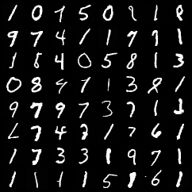
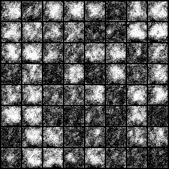

# 《扩散模型原理详解》及代码

[教程pdf](./main.pdf)

代码提供了用Diffusion训练手写数字的示例，需要安装[denoising-diffusion-pytorch](https://github.com/lucidrains/denoising-diffusion-pytorch)。

```bash
python main.py
```

训练36个epoch的效果图：



训练37个epoch的效果图（训崩了，可见要训好一个diffusion也不是一件容易事）：

