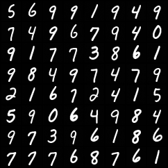

# 《扩散模型原理详解》及代码

[教程pdf](./main.pdf)

代码提供了用Diffusion训练手写数字的示例，代码基于[denoising-diffusion-pytorch](https://github.com/lucidrains/denoising-diffusion-pytorch)，该仓库里的代码有一些例如self-conditioning的冗余操作，在这里依照原始DDPM论文的方法进行了删改。

```bash
python main.py
python sampling.py
```

训练50个epoch的效果图：


